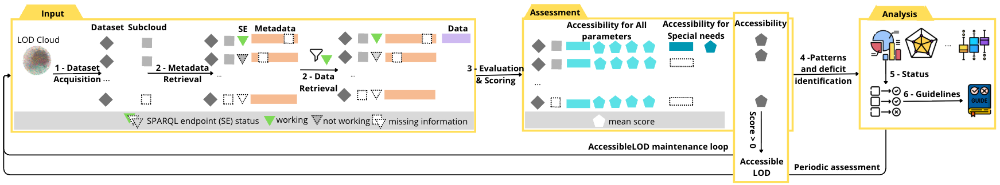

# AccessibleLOD — The Accessible Linked Open Data (sub)cloud

This repository contains the AccessibleLOD WebApp, served as GitHub pages and the supplementary material of the article *"Accessibility in the Linked Open Data Cloud"*.

## Repository Structure

```
├── supplementary_materials/
│   ├── KGHeartBeat-Accessibility_module/   # Python toolkit to compute accessibility metrics
│   ├── accessibility_evaluation_results/   # Complete results discussed in the article
│   ├── LOD_cloud_snapshot/                 # LOD Cloud JSON snapshot 
│   └── ontology/                           # AccessibleLOD ontology (TTL)
├── WebApp/                            # Development (frontend/backend placeholders)
├── index.html                         # Built web app entrypoint 
├── static/                            # Built JS/CSS assets
├── manifest.json, asset-manifest.json # Build metadata
├── LICENSE                            # CC BY 4.0
└── README.md
```


## Procedure for evaluating the accessibility of the Linked Open Data Cloud and the exposition of AccessibleLOD


## Using the Accessibility Toolkit (Python)

The Python code to compute the metrics lives under `supplementary_materials/KGHeartBeat-Accessibility_module/`.

Prerequisites:

- Python 3.9+
- Network access to public endpoints (datasets’ websites, VoID files, SPARQL endpoints)

Install dependencies and run:

```bash
cd supplementary_materials/KGHeartBeat-Accessibility_module

# (optional) create a virtual env
python3 -m venv .venv
source .venv/bin/activate

# install dependencies
pip -r requirements.txt

# run the analysis 
python3 main.py
```

Outputs (in the same folder):

- `HumanAccessibility_results.json` — full per-dataset metric values 
- `HumanAccessibility_results.csv` — same in tabular form
- `HumanAccessibility_results_scores.csv` — numeric summary columns for quick comparison

Tip: you can control the processing window by editing `start_from_kg_id` in `main.py` to resume from a specific dataset ID (e.g., `"dbpedia"`).

## The accesibleLOD ontology

- File: `supplementary_materials/ontology/lodaccessible.ttl`
- Captures accessibility categories, dimensions, and metrics aligned to WCAG principles and the DQV model.


## License

This work is licensed under the Creative Commons Attribution 4.0 International (CC BY 4.0) license. See `LICENSE` for details.


